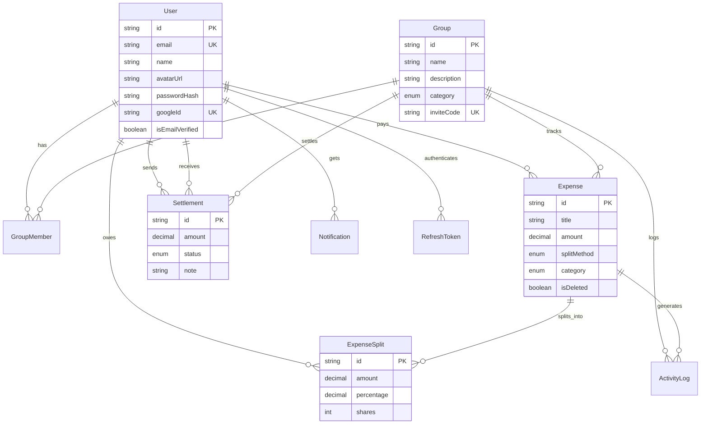

# SettleUp – Project Architecture & Overview

> A modern, collaborative expense management system designed to seamlessly track group expenses, optimize debts, and facilitate transparent settlements.

---

## Table of Contents

- [Tech Stack](#tech-stack)
- [Repository Structure](#repository-structure)
- [Design System & Color Theme](#design-system--color-theme)
- [Pages & Responsibilities](#pages--responsibilities)
- [Core System Logic](#core-system-logic)
- [Database Architecture](#database-architecture)
- [API Endpoint Map](#api-endpoint-map)
- [Architectural Review & Improvements](#architectural-review--improvements)
- [Build Order & Roadmap](#build-order--roadmap)

---

## Tech Stack

| Layer | Technology | Purpose |
|---|---|---|
| **Monorepo** | Turborepo + pnpm workspaces | Task orchestration, dependency sharing |
| **Backend** | NestJS 11 + TypeScript | REST API, business logic, WebSocket gateway |
| **Database** | PostgreSQL 16 + Prisma 7 | Relational data, migrations, type-safe ORM |
| **Frontend** | React 19 + Vite 7 | SPA with HMR, fast builds |
| **Styling** | TailwindCSS 4 + shadcn/ui 4 | Component library, design tokens |
| **State** | Zustand + TanStack React Query | Client state + server cache |
| **Auth** | Passport (Google OAuth + JWT) | Authentication strategy |
| **Real-time** | Socket.io | Live expense updates, notifications |
| **File Storage** | Cloudflare R2 (S3-compatible) | Receipt uploads |
| **Validation** | Zod (`@settleup/shared`) | Shared schemas across frontend & backend |
| **Charts** | Recharts | Analytics visualizations |
| **DevOps** | Docker Compose + Docker Engine v29 | Containerized local development |

---

## Repository Structure

```
SettleUp/
├── apps/
│   ├── api/                    # NestJS backend
│   │   ├── prisma/
│   │   │   └── schema.prisma   # Database schema (10 models)
│   │   ├── src/                # Application source
│   │   ├── Dockerfile.dev      # Dev container
│   │   └── .env.example        # Environment template
│   └── web/                    # Vite + React frontend
│       ├── src/
│       │   ├── components/     # UI components (shadcn)
│       │   ├── lib/            # Utilities
│       │   └── index.css       # Design tokens + Tailwind
│       └── Dockerfile.dev      # Dev container
├── packages/
│   └── shared/                 # @settleup/shared
│       └── src/
│           ├── schemas/        # Zod validation schemas
│           └── types/          # TypeScript type definitions
├── docker-compose.yml          # PostgreSQL + API + Web
├── turbo.json                  # Task pipeline config
└── pnpm-workspace.yaml         # Workspace definition
```

---

## Design System & Color Theme

### Recommended: "Neon Clay" — Light Claymorphic Fintech

A bright, friendly palette that makes finances feel approachable. It uses **Claymorphism**—soft, matte surfaces with pillowy 3D inner/outer shadows—combined with extremely vibrant neon greens to signify positive balances and completion.

### Color Palette

| Role | Color | Hex | Tailwind Equivalent | Usage |
|---|---|---|---|---|
| **Background / Base** | Soft Clay | `#F3F4F6` | `gray-100` | Global app background |
| **Surface** | Solid White | `#FFFFFF` | `white` | Cards, modals, elevated surfaces |
| **Primary Text** | Dark Charcoal | `#292929` | `neutral-800` | All main text, headings, numbers |
| **Secondary Text** | Muted Slate | `#6B7280` | `gray-500` | Labels, unselected states |
| **Brand (Primary)** | Neon Green | `#00C700` | `green-600` | Primary CTAs, "You are owed", Success |
| **Secondary Accent**| Lime Green | `#6CE71D` | `lime-400` | Hover states, glowing accents, charts |
| **Debt / Negative** | Coral Red | `#FF4B4B` | `red-500` | "You owe", destructive actions, warnings |

### Visual Treatment (Claymorphism)

- **Clay Shadows**: Instead of sharp borders, cards use dual shadows: a soft drop shadow (`box-shadow: 8px 8px 16px #d1d5db, -8px -8px 16px #ffffff`) and sometimes an inset shadow for depressed button states.
- **Matte Surfaces**: No glass, no transparency, no blur. Solid, soft, opaque colors.
- **Border Radius**: Exaggerated, bubbly corners (`--radius: 1.5rem` or `24px`).
- **Typography**: `Geist Variable` or a rounded friendly sans-serif (e.g., `Nunito`). High contrast against the light clay background.
- **Animations**: Pillowy, bouncy spring transitions (like pressing into software clay).

### Emoji Indicators (UI Guideline)

| State | Visual |
|---|---|
| You are owed | 🟢 Neon Green `#00C700` amount text |
| You owe | 🔴 Coral Red `#FF4B4B` amount text |
| Settled up | ✅ Neutral gray text with checkmark |
| Pending | 🟡 Yellow dot / sand clock icon |

---

## Pages & Responsibilities

### 1. Auth Page — `/login`, `/register`

**Purpose**: Secure entry point with zero-friction onboarding.

| Feature | Detail |
|---|---|
| Google OAuth | Single-click login via `passport-google-oauth20` |
| Email + Password | Fallback auth with bcrypt hashing |
| JWT Tokens | Access (15m) + Refresh (7d) with rotation |
| Post-login | Redirect to Dashboard |

**Endpoints**: `POST /auth/register` · `POST /auth/login` · `POST /auth/refresh` · `GET /auth/google`

---

### 2. Dashboard — `/dashboard`

**Purpose**: Group hub — the landing page after authentication.

| Section | Description |
|---|---|
| Group Cards | Display all groups with member count, total expense, last activity |
| Quick Stats | Total you owe across all groups, total owed to you |
| Create Group | Modal with name, category, description |
| Join Group | Input field accepting invite codes / links |

**Endpoints**: `GET /groups` · `POST /groups` · `POST /groups/join`

---

### 3. Group Details Page — `/groups/:id` *(Core Page)*

**Purpose**: The command center. All financial tracking concentrates here.

#### Sections:

| Section | Description |
|---|---|
| **Header** | Group name, member avatars, category badge, total group spend |
| **Balance Summary** | Per-member net balance — "You owe ₹500" or "Ajja owes you ₹300" |
| **Expense Feed** | Paginated/infinite-scroll list of expenses with title, amount, payer, date, participants |
| **Quick Add** | Floating action button to open expense creation modal |
| **Settlement Suggestions** | Optimized transaction graph — minimal transfers to zero out all debts |

**Endpoints**: `GET /groups/:id` · `GET /groups/:id/expenses` · `GET /groups/:id/balances`

---

### 4. Add / Edit Expense — Modal or `/groups/:id/expenses/new`

**Purpose**: The most complex UI form in the system.

#### Fields:

| Field | Type | Required |
|---|---|---|
| Title | Text | ✅ |
| Amount | Number (integer, stored as paise) | ✅ |
| Paid By | Member selector | ✅ |
| Participants | Multi-select from group members | ✅ |
| Split Method | EQUAL / EXACT / PERCENTAGE / SHARES | ✅ |
| Category | Select (Food, Transport, etc.) | Optional |
| Date | Date picker | Optional (defaults to now) |
| Notes | Textarea | Optional |
| Receipt | File upload (to R2) | Optional |

#### Split Methods:

| Method | UI Behavior |
|---|---|
| **Equal** | Auto-divide amount by participant count |
| **Exact** | Manual amount per person, must sum to total |
| **Percentage** | Slider/input per person, must sum to 100% |
| **Shares** | Integer shares per person, divide proportionally |

> **MVP**: Ship with EQUAL only. The form architecture should use a state machine pattern so adding split modes later is additive, not a rewrite.

**Endpoints**: `POST /expenses` · `PATCH /expenses/:id` · `DELETE /expenses/:id`

---

### 5. Balance & Settlement — `/groups/:id/settlements`

**Purpose**: Dedicated ledger for resolving debts.

| Feature | Description |
|---|---|
| Debt Map | Who owes whom, exact amounts |
| Optimized Suggestions | Minimum transaction graph |
| Settle Action | Mark a payment as settled (with optional note) |
| Settlement History | Immutable log of completed settlements |

**Endpoints**: `GET /groups/:id/balances` · `POST /settlements` · `PATCH /settlements/:id`

---

### 6. Activity / History — Tab within Group Page

**Purpose**: Immutable audit trail of all group actions.

| Event Types |
|---|
| Expense added / updated / deleted |
| Settlement created / confirmed / rejected |
| Member joined / left |
| Group settings changed |

**Endpoint**: `GET /groups/:id/activity`

---

### 7. Analytics Dashboard — `/groups/:id/analytics`

**Purpose**: Visual spending insights (V2 feature).

| Chart | Type | Library |
|---|---|---|
| Category breakdown | Pie/Donut | Recharts |
| Member contribution | Horizontal bar | Recharts |
| Monthly trend | Area/Line | Recharts |
| Spending heatmap | Calendar grid | Custom |

**Endpoint**: `GET /groups/:id/analytics`

---

### 8. Profile & Settings — `/profile`

**Purpose**: User account management.

| Feature | Detail |
|---|---|
| Edit name | Text input |
| Update avatar | File upload to R2 |
| Notification preferences | Toggle per type |
| Logout | Clear tokens, redirect to login |

**Endpoints**: `GET /users/me` · `PATCH /users/me` · `POST /auth/logout`

---

## Core System Logic

### Expense Flow

```
User submits expense
       │
       ▼
┌──────────────────┐
│  Validate Input  │  ← Zod schema from @settleup/shared
└────────┬─────────┘
         │
         ▼
┌──────────────────┐
│  Store Expense   │  ← Single DB transaction
│  + Create Splits │
└────────┬─────────┘
         │
         ▼
┌──────────────────────────┐
│  Update GroupMemberBalance│  ← Materialized balance rows
│  (within same transaction)│
└────────┬─────────────────┘
         │
         ▼
┌──────────────────┐
│  Log Activity    │
│  Emit WebSocket  │
└──────────────────┘
```

### Balance Calculation (Event-Sourced)

Instead of recalculating from all historical expenses on every request:

```
When expense is created:
  → payer's balance   += expense.amount
  → each split user's balance -= split.amount

GET /groups/:id/balances → O(1) lookup from GroupMemberBalance table
```

**Net balance per user**:
```
net_balance = total_paid - total_owed
  Positive → others owe you money
  Negative → you owe money
```

### Settlement Optimization Algorithm

Uses a **Greedy Net-Balance** approach to minimize total transactions:

```
1. Calculate net balance per member
2. Separate into creditors (+) and debtors (-)
3. Sort creditors descending, debtors ascending (by abs value)
4. Match largest creditor with largest debtor
5. Transfer min(credit, |debt|)
6. Remove zeroed-out members
7. Repeat until all balances are 0
```

**Example**:
```
Before:  Ajja: +500, Sadhique: -300, Rahul: -200
         
Step 1:  Sadhique → Ajja ₹300   (Sadhique: 0, Ajja: +200)
Step 2:  Rahul → Ajja ₹200      (Rahul: 0, Ajja: 0)

Result:  2 transactions instead of potentially more
```

---

## Database Architecture

### Current Schema (10 Models)



---

## API Endpoint Map

### Auth
| Method | Endpoint | Description |
|---|---|---|
| `POST` | `/auth/register` | Create account with email + password |
| `POST` | `/auth/login` | Login, receive access + refresh tokens |
| `POST` | `/auth/refresh` | Rotate refresh token |
| `POST` | `/auth/logout` | Revoke refresh token |
| `GET` | `/auth/google` | Initiate Google OAuth flow |
| `GET` | `/auth/google/callback` | Google OAuth callback |

### Groups
| Method | Endpoint | Description |
|---|---|---|
| `GET` | `/groups` | List user's groups |
| `POST` | `/groups` | Create a new group |
| `GET` | `/groups/:id` | Get group details + members |
| `PATCH` | `/groups/:id` | Update group info |
| `DELETE` | `/groups/:id` | Delete group (owner only) |
| `POST` | `/groups/join` | Join via invite code |
| `POST` | `/groups/:id/leave` | Leave group |

### Expenses
| Method | Endpoint | Description |
|---|---|---|
| `GET` | `/groups/:id/expenses` | List expenses (paginated) |
| `POST` | `/groups/:id/expenses` | Create expense + splits |
| `GET` | `/expenses/:id` | Get expense detail |
| `PATCH` | `/expenses/:id` | Update expense (creates version) |
| `DELETE` | `/expenses/:id` | Soft-delete expense |

### Balances & Settlements
| Method | Endpoint | Description |
|---|---|---|
| `GET` | `/groups/:id/balances` | Get all member balances |
| `GET` | `/groups/:id/settlements/suggestions` | Get optimized settlement plan |
| `POST` | `/groups/:id/settlements` | Record a settlement |
| `PATCH` | `/settlements/:id` | Confirm/reject settlement |

### Activity & Analytics
| Method | Endpoint | Description |
|---|---|---|
| `GET` | `/groups/:id/activity` | Get activity log (paginated) |
| `GET` | `/groups/:id/analytics` | Get spending analytics |

### User
| Method | Endpoint | Description |
|---|---|---|
| `GET` | `/users/me` | Get current user profile |
| `PATCH` | `/users/me` | Update profile |

---

## Architectural Review & Improvements

After auditing the current codebase, here are the findings organized by severity.

### 🔴 Critical Issues

#### 1. Missing `url` in Prisma datasource
The `datasource db` block in `schema.prisma` is missing the connection URL:
```diff
  datasource db {
    provider = "postgresql"
+   url      = env("DATABASE_URL")
  }
```
Without this, Prisma cannot connect to the database at all.

#### 2. `app.module.ts` is empty scaffold
The NestJS entry module imports nothing — no `ConfigModule`, no `PrismaModule`, no feature modules. Every dependency (`@nestjs/config`, `@nestjs/jwt`, `@nestjs/passport`, `@nestjs/throttler`) is installed but unused.

#### 3. No `GroupMemberBalance` table
Balances are not materialized anywhere. Without this, every balance query must scan all expenses and splits — an O(N) bottleneck that gets worse over time. 

**Recommendation**: Add a `GroupMemberBalance` model:
```prisma
model GroupMemberBalance {
  id        String  @id @default(cuid())
  groupId   String
  userId    String
  balance   Int     @default(0)  // stored in paise/cents

  group Group @relation(fields: [groupId], references: [id], onDelete: Cascade)
  user  User  @relation(fields: [userId], references: [id])

  @@unique([groupId, userId])
  @@map("group_member_balances")
}
```
Update this row atomically inside the same transaction that creates an expense.

### 🟡 Important Improvements

#### 4. Use Integer for money, not Decimal
`Decimal(10,2)` in PostgreSQL works, but integer arithmetic (storing amounts in **paise/cents**) is universally safer:
- No floating-point edge cases in split calculations
- Simpler equality comparisons
- Industry standard (Stripe, Razorpay all use integer cents)

**Recommendation**: Change `amount` fields to `Int` and store `₹500.50` as `50050`.

#### 5. Add `currencyCode` to Group
Hardcoding `₹` everywhere in the frontend is brittle. Store currency at the group level:
```prisma
model Group {
  // ... existing fields
  currencyCode String @default("INR")  // ISO 4217
}
```

#### 6. Settlement default status should be `PENDING`
Currently defaults to `CONFIRMED`. For a proper 2-party workflow:
- Payer records settlement → status = `PENDING`
- Receiver confirms → status = `CONFIRMED`
- Receiver rejects → status = `REJECTED`

#### 7. `ExpenseSplit.isPaid` is misleading
Individual splits are not "paid" — settlements operate at the user-to-user level, not the split level. This field will cause confusion.

**Recommendation**: Remove `isPaid` from `ExpenseSplit`. Track settlement state through the `Settlement` model and the `GroupMemberBalance` materialized view.

#### 8. Frontend routing is not set up
`react-router-dom` is installed but `App.tsx` is still the default Vite scaffold. The router needs to be wired up before any pages can be built.

#### 9. CSS has conflicting styles
`index.css` contains both Vite default styles (`:root`, `a`, `button`, `@media prefers-color-scheme`) AND shadcn/tailwind tokens. The Vite defaults should be removed — shadcn handles everything.

### 🟢 Things Already Done Well

| Feature | Status |
|---|---|
| Soft deletes on Expense (`isDeleted`) | ✅ Implemented |
| ActivityLog with JSON metadata | ✅ Well-designed |
| Notification model with types | ✅ Ready for push notifications |
| Refresh token rotation | ✅ Secure pattern |
| GroupMember roles (OWNER/ADMIN/MEMBER) | ✅ RBAC ready |
| Invite codes on Group | ✅ Shareable links |
| Database indexing strategy | ✅ Good composite + single indexes |
| Shared Zod schemas package | ✅ Single source of truth |
| Geist font for numeric readability | ✅ Great choice |

---

## Build Order & Roadmap

### Phase 1 — Foundation (Current → Week 2)

```
1. Fix Prisma schema (datasource url, add GroupMemberBalance, currency)
2. Build NestJS module structure:
   └── PrismaModule → AuthModule → UsersModule → GroupsModule
3. Implement Auth (Google OAuth + JWT + refresh rotation)
4. Implement Groups CRUD + join/leave
5. Wire frontend routing (React Router)
6. Build Auth pages + Dashboard skeleton
```

### Phase 2 — Core Engine (Week 2 → Week 4)

```
1. Implement ExpensesModule (create with equal split)
2. Implement balance calculation service (materialized balances)
3. Implement settlement optimization algorithm
4. Build Group Details page (balance summary + expense feed)
5. Build Add Expense modal (equal split only)
6. Build Settlement suggestions UI
```

### Phase 3 — Polish & Complete (Week 4 → Week 6)

```
1. Add advanced split methods (exact, percentage, shares)
2. Build Activity timeline
3. Add receipt upload (R2 integration)
4. Add real-time updates (Socket.io for live expense sync)
5. Build Profile page
6. Add notification system
```

### Phase 4 — Analytics & Scale (Week 6+)

```
1. Analytics dashboard with Recharts
2. PWA support for mobile
3. Email notifications (settlement reminders)
4. Export group data (PDF/CSV)
5. Multi-currency support
6. Docker production builds (multi-stage + turbo prune)
```

---

## MVP Scope (V1 Checklist)

- [x] Prisma schema defined
- [x] Docker Compose setup
- [x] Shared validation package
- [ ] Auth (Google OAuth + email)
- [ ] Create / join groups
- [ ] Add expense (equal split)
- [ ] View balances
- [ ] Settlement suggestions
- [ ] Basic group page UI

**Explicitly excluded from V1:**
- Advanced split logic (percentage, shares, itemized)  
- Real-time WebSocket updates
- Analytics charts
- Receipt OCR / AI features
- Push notifications


# How SettleUp Can Beat GPay Split

## GPay Split has serious limitations that are your opportunity:


| GPay Split weaknesses                 | SettleUp advantage                   |
|---------------------------------------|--------------------------------------|
| Only works within GPay users          | Works for everyone — any UPI app     |
| No expense categorization             | Full categories, receipts, notes     |
| No split history / detailed tracking  | Complete expense history with splits |
| No group management                   | Groups, invite codes, roles          |
| Can only split equally                | Equal, percentage, exact, shares     |
| No settlement optimization            | Greedy algorithm minimizes payments  |
| Buried inside GPay's UI               | Dedicated app, purpose-built UX      |
| No activity feed / audit trail        | Full activity log                    |